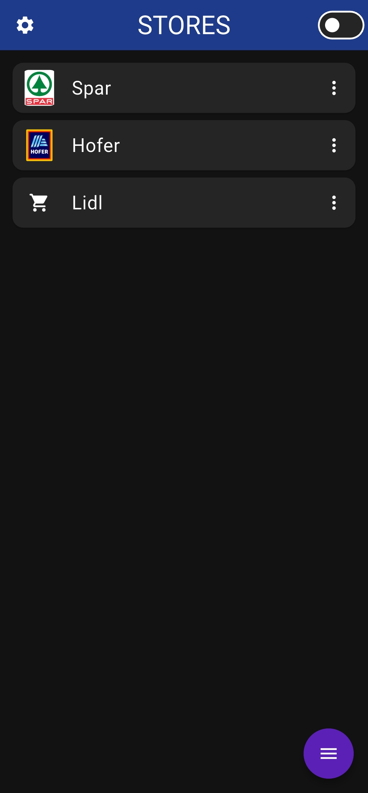
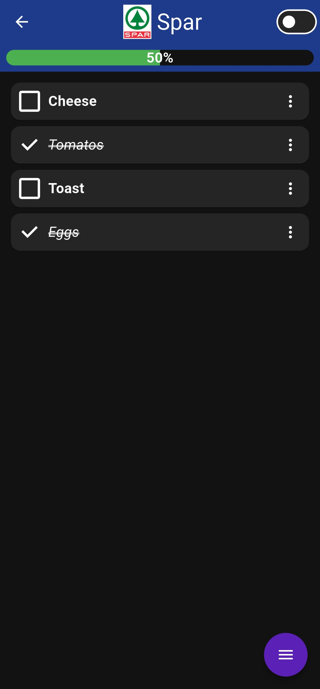
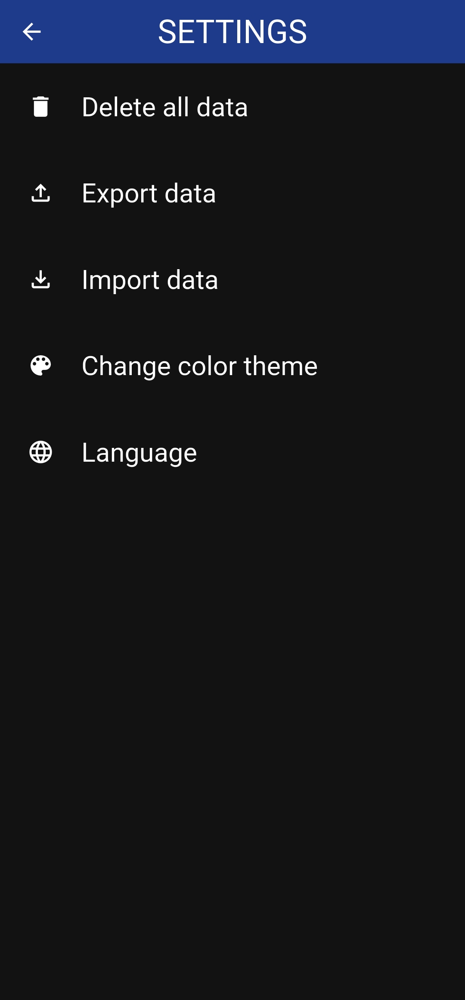
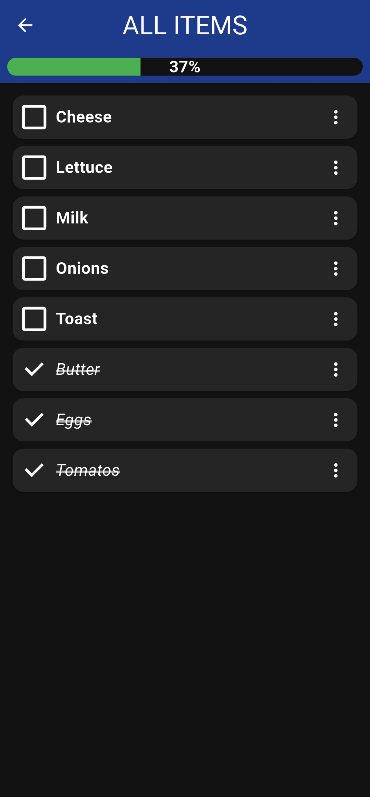

# Shopping list app

A simple, fast shopping list app for Android that helps you organize groceries by stores and order them in whatever order you want.

## Screenshots

  
  
  
  

## Features

- Store management — create multiple stores
- Custom or alphabetical sorting — order stores manually or alphabetically
- Item ordering — sort items within each store manually or alphabetically
- Linked items — items with the same name are linked across stores
- Import/export — back up or transfer your data from Settings
- Custom themes — build your own theme
- Language selection — choose your preferred language in Settings
- Ad-free — no ads, ever
- Free of charge — no cost to use

## Contributing
Created by Dimnik (Hampter-07).
Contributions, bug reports, and improvements are welcome!